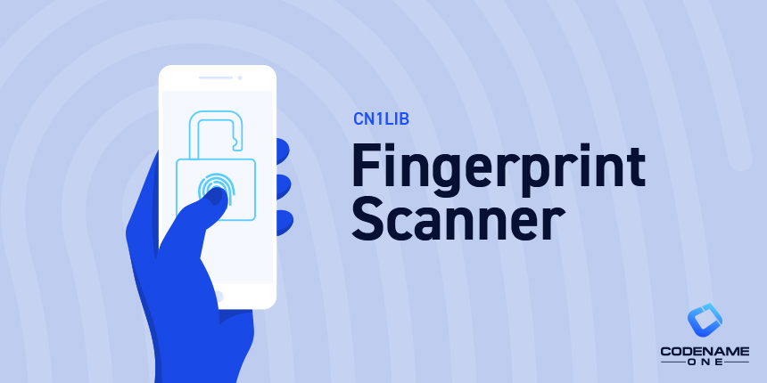

= Fingerprint Scanner

Fingerprint scanning and biometric support for https://www.codenameone.com[Codename One].

This cn1lib provides basic support for fingerprint scanning on iOS/Android with one API. Due to the difference between the two implementations we chose a simplified approach that just verifies the fingerprint and doesn't delve into the nuanced complexities for this API.

== Supported Platforms

Currently this library supports only Android (API 23+), and iOS.

== Installation

For instructions on installing cn1libs, see https://www.codenameone.com/blog/automatically-install-update-distribute-cn1libs-extensions.html[this tutorial].

=== Alternate Maven Installation

If your project uses Maven, the above installation instructions will still work, but you can alternately simply add the Maven dependency to your common/pom.xml file:

[source,xml]
----
<dependency>
  <groupId>com.codenameone</groupId>
  <artifactId>fingerprint-scanner-lib</artifactId>
  <version>1.0</version>
  <type>pom</type>
</dependency>
----

[IMPORTANT]
====
Android builds *must* use build tools 29 or higher.  E.g.  Add the following build hints:

----
android.buildToolsVersion=29.0.3
android.targetSdkVersion=29.0.3
----
====

== Basic Usage

[source,java]
----
Fingerprint.scanFingerprint("Use your finger print to unlock AppName.", value -> {
    Log.p("Scan successfull!");
}, (sender, err, errorCode, errorMessage) -> {
    Log.p("Scan Failed!");
});
----

Note that the values passed to value/fail are `null` and don't include any data at this time...

Also check out the following samples:

. https://github.com/codenameone/FingerprintScannerTest[FingerprintScannerTest App] - Basic usage.  Just fingerprint scanning.
. https://github.com/codenameone/CodenameOne/blob/master/Samples/samples/FingerprintScannerSample/FingerprintScannerSample.java[FingerprintScannerSample] - From Codename One samples.  Includes sample of storing, retrieving, and deleting passwords.

== Protecting Passwords with Fingerprints

This library also allows you to store passwords in the system keychain, protected by biometric authentication.  The user will be asked to authenticate with their fingerprint (or Face recognition on supported devices) in order to retrieve passwords using this library.  On Android, currently the user is also prompted to authenticate when storing passwords as well.

NOTE: While these methods say that they are for storing passwords, you can use them for storing any text.  Both Android and iOS should allow you to store strings of sufficiently large size to store anything you might otherwise store in Preferences.

=== Storing Passwords

[source,java]
----
String account = "steve@example.com";
String password = "....";

Fingerprint.addPassword(
    "Adding secure item to keystore", // Message to display in authentication dialog
    account, 
    password
).onResult((success, err)->{
    if (err != null) {
        Log.e(err);
        ToastBar.showErrorMessage("Failed to add password to keystore: "+ err.getMessage());
    } else {
        // success always true if there was no error.
        ToastBar.showInfoMessage("Successfully added password to keystore");
    }
});
----

=== Retrieving Passwords

[source,java]
----
String account = "steve@example.com";

Fingerprint.getPassword(
    "Getting secure item",  // Message to display in auth dialog
    account
).onResult((password, err)->{
    if (err != null) {
        // Error condition occurs both if the keychain doesn't have 
        // a password for the given account, or if a failure occurs
        // in retrieving it.
        // NOTE:  If the user adds a finger or face to biometric scanning
        // or disables password protection on the device, all passwords
        // will be purged automatically.
        Log.e(err);
        ToastBar.showErrorMessage("Failed to get password: " + err.getMessage());
    } else {
        System.out.println("The password was "+password);
    }
});
----

=== Deleting Passwords

[source,java]
----
String account = "steve@example.com";

Fingerprint.deletePassword(
    "Getting secure item",   // Message to display in auth dialog
    keyName.getText()
).onResult((res, err)->{
    if (err != null) {
        Log.e(err);
        ToastBar.showErrorMessage("Failed to delete password: "+err.getMessage());
    } else {
        System.out.println("Deleted the password for account "+account);
    }
});
----

=== Password Invalidation

Passwords stored in the keychain will be automatically purged if any of the following occurs:

. The user adds additional fingers to fingerprint authentication.
. The user adds additional faces to face ID biometric authentication.
. The user turns off phone login security.  E.g. if they turn off password or fingerprint requirements for login to the phone.

=== Android Implementation

Currently, on Android we are using the https://developer.android.com/reference/android/hardware/fingerprint/FingerprintManager[FingerprintManager] class for authentication on API 28 (Android 9) and lower and https://developer.android.com/reference/android/hardware/biometrics/BiometricPrompt[BiometricPrompt] on devices running API 29 (Android 10) and higher.  This means that Android 9, despite supporting Face recognition at an OS level, will use FingerPrintManager and will not support face recognition for authentication.  Future versions may attempt to incorporate workarounds to add this support to Android 9, e.g. https://github.com/sergeykomlach/AdvancedBiometricPromptCompat[AdvancedBiometricPromptCompat].

Passwords are not, themselves, stored inside the system Keystore.  Rather, a symmetric Key is generated and stored inside the keychain, which is used to encrypt and decrypt the passwords, which are stored private `SharedPreferences`.

Currently the key specifications are:

[source,java]
----
new KeyGenParameterSpec.Builder(
    KEY_ID,
    KeyProperties.PURPOSE_ENCRYPT | KeyProperties.PURPOSE_DECRYPT
)
.setBlockModes(KeyProperties.BLOCK_MODE_CBC)
.setUserAuthenticationRequired(true)
.setEncryptionPaddings(KeyProperties.ENCRYPTION_PADDING_PKCS7)
----

Refer to the https://developer.android.com/reference/android/security/keystore/KeyGenParameterSpec.Builder[KeyGenParameterSpec.Builder docs] for a more detailed description of what these settings mean.

The `.setUserAuthenticationRequired(true)` call is what causes the key to become invalid when the user adds fingers or faces to authentication.

=== iOS Implementation

On iOS, the library acts as a thin layer on top of the https://developer.apple.com/documentation/security/1401659-secitemadd?language=objc[SecItemAdd], https://developer.apple.com/documentation/security/1398306-secitemcopymatching?language=objc[SecItemCopyMatching], and https://developer.apple.com/documentation/security/1395547-secitemdelete?language=objc[SecItemDelete] functions which directly add passwords to the keychain.

The security settings on the passwords are:

[source,objective-c]
----
SecAccessControlRef sacRef = SecAccessControlCreateWithFlags(kCFAllocatorDefault,
    kSecAttrAccessibleWhenPasscodeSetThisDeviceOnly,
    kSecAccessControlTouchIDCurrentSet,
    nil
);
----

For more details on what these mean, see the following documentation pages:

. https://developer.apple.com/documentation/security/secaccesscontrolref?language=objc[SecAccessControlRef]
. https://developer.apple.com/documentation/security/ksecattraccessiblewhenpasscodesetthisdeviceonly?language=objc[kSecAttrAccessibleWhenPasscodeSetThisDeviceOnly]
. https://developer.apple.com/documentation/security/secaccesscontrolcreateflags/ksecaccesscontroltouchidcurrentset?language=objc[kSecAccessControlTouchIDCurrentSet]

==== Sharing Keychain Items with App Extensions

By default, keychain items stored by the Fingerprint API are only accessible from the main app. To share keychain items with app extensions (such as Action Extensions, Share Extensions, or other extension types), you can specify a shared keychain access group.

This is particularly useful for scenarios like:

* Apple Wallet provisioning flows that require an Action Extension to access authentication tokens
* Share Extensions that need to authenticate with stored credentials
* Today Widget Extensions that display authenticated content

===== Step 1: Configure Keychain Access Group Entitlement

Add the keychain access group to your Codename One project using the `ios.keychainAccessGroup` build hint. This can be set in your project's `codenameone_settings.properties` file or through the Codename One Settings GUI:

----
ios.keychainAccessGroup=TEAMID123.group.com.example.myapp
----

Replace `TEAMID123.group.com.example.myapp` with your full keychain access group identifier, which **must** include your Team ID (also called App Identifier Prefix). The access group format is:

----
[TEAM_ID].[group_name]
----

For example: `ABCDE12345.group.com.example.myapp`

**Finding Your Team ID:**

You can find your Team ID in:

* Your Apple Developer account (under Membership details)
* Xcode → Project Settings → Signing & Capabilities → Team (shown in parentheses)
* Certificates, Identifiers & Profiles section of developer.apple.com

The access group must be consistent across your main app and all extensions that need access.

[IMPORTANT]
====
The Team ID prefix is **required** for keychain access groups to work properly. Without it, keychain operations will fail with errSecMissingEntitlement.
====

===== Step 2: Configure Extensions

If you have app extensions, ensure they also have the same keychain access group entitlement configured. For native iOS extensions, add the keychain-access-groups entitlement in the extension's Info.plist or entitlements file:

[source,xml]
----
<key>keychain-access-groups</key>
<array>
    <string>$(AppIdentifierPrefix)group.com.example.myapp</string>
</array>
----

===== Step 3: Set the Display Property in Your Code

Before using the Fingerprint API to store or retrieve passwords, set the keychain access group display property:

[source,java]
----
import com.codename1.ui.Display;
import com.codename1.fingerprint.Fingerprint;

// Set this early in your app initialization, before using Fingerprint API
Display.getInstance().setProperty(
    "Fingerprint.ios.keychainAccessGroup",
    "TEAMID123.group.com.example.myapp"
);
----

[IMPORTANT]
====
* Set the property **before** calling any Fingerprint password methods (addPassword, getPassword, deletePassword)
* Use the **exact same access group identifier including the Team ID prefix** that you configured in the build hint
* The property must be set in both your main app and your extensions
* The Team ID prefix is **required** - omitting it will cause keychain operations to fail
====

===== Complete Example

Here's a complete example for a main app that shares credentials with an Action Extension:

[source,java]
----
// In your main app's start() method or before using Fingerprint
public void start() {
    if (current != null) {
        current.show();
        return;
    }

    // Configure shared keychain access group (must include Team ID prefix)
    Display.getInstance().setProperty(
        "Fingerprint.ios.keychainAccessGroup",
        "TEAMID123.group.com.example.myapp"
    );

    // Now store credentials that will be accessible from extensions
    String account = "user@example.com";
    String token = "auth_token_12345";

    Fingerprint.addPassword(
        "Storing credentials for extension access",
        account,
        token
    ).onResult((success, err) -> {
        if (err != null) {
            Log.e(err);
            ToastBar.showErrorMessage("Failed to store credentials: " + err.getMessage());
        } else {
            Log.p("Credentials stored in shared keychain group");
            ToastBar.showInfoMessage("Credentials saved");
        }
    });
}
----

In your extension code (whether native or using Codename One):

[source,java]
----
// Set the same property in your extension (must include Team ID prefix)
Display.getInstance().setProperty(
    "Fingerprint.ios.keychainAccessGroup",
    "TEAMID123.group.com.example.myapp"
);

// Retrieve credentials stored by the main app
String account = "user@example.com";

Fingerprint.getPassword(
    "Authenticating from extension",
    account
).onResult((token, err) -> {
    if (err != null) {
        Log.e(err);
        ToastBar.showErrorMessage("Failed to retrieve credentials: " + err.getMessage());
    } else {
        Log.p("Retrieved token: " + token);
        // Use token for authentication in extension
        performAuthentication(token);
    }
});
----

===== Important Notes

* **Backward Compatibility**: If you don't set the `Fingerprint.ios.keychainAccessGroup` property, keychain items will be stored in the default app-specific keychain group (current behavior)
* **Migration**: Items stored without an access group cannot be accessed when an access group is specified, and vice versa. If you're adding this feature to an existing app, users may need to re-authenticate
* **Security**: All targets (app and extensions) with the shared access group entitlement can access the keychain items. Only share with trusted extensions
* **Access Group Format**: Both the `ios.keychainAccessGroup` build hint AND the `Fingerprint.ios.keychainAccessGroup` property must include the full access group identifier with the Team ID prefix (e.g., `TEAMID123.group.com.example.myapp`)
* **Team ID is Required**: The Team ID prefix is mandatory in both the build hint and the runtime property. Omitting it will cause keychain operations to fail with errSecMissingEntitlement
* **Error Handling**: If your app attempts to use an access group it's not entitled to, keychain operations will fail with an error (errSecMissingEntitlement). Ensure the build hint and property match exactly

== Working with the Sources

. Check out with `git clone https://github.com/codenameone/FingerprintScanner`
. Build with `mvn package`
.. You'll find cn1lib in the _common/target_ directory.

See https://shannah.github.io/codenameone-maven-manual/[the Codename One Maven Manual] for more information about working with Codename One Maven projects.

=== Releasing to Maven Central

1. Set up your ~/.m2/settings.xml file with credentials for Maven central.
2. Run `bash update-version.sh $NEW_VERSION` where `$NEW_VERSION` is the new version.  E.g. "1.1".
3. `git push && git push --tags` to push the new version tag to git.
4. `mvn deploy -Psign-artifacts`
5. Log into Maven central and complete the release.
6. Run `bash update-version $NEW_SNAPSHOT_VERSION` where `$NEW_SNAPSHOT_VERSION` is the next snapshot version  E.g. 1.2-SNAPSHOT.

